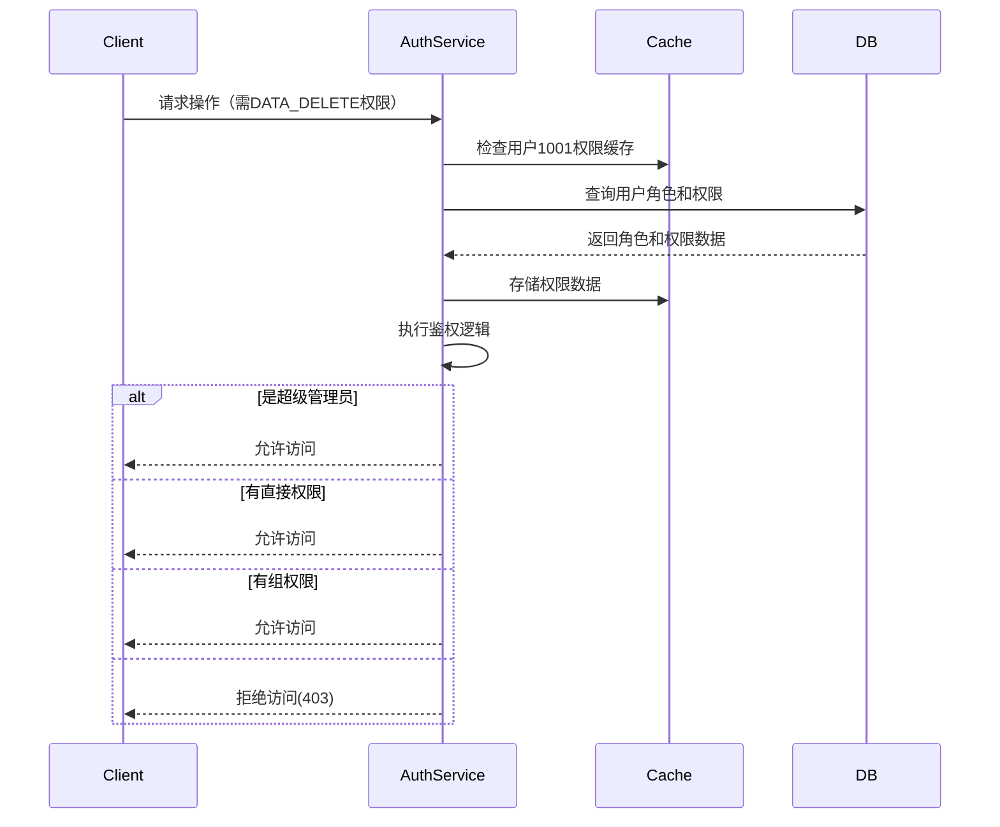

# RBAC Design: Role-Based Access Control Design

RBAC是每一个涉及到权限控制的系统都需要设计的部分。它提供了一种灵活的方式来管理用户权限，确保系统的安全性和可维护性。

在微信登录完成后，我们可以获取到OpenID和UnionID，我们需要根据用户的角色和权限来控制他们在系统中的操作。RBAC设计将帮助我们实现这一目标。

系统采用 **用户-角色-权限** 三级关系进行权限控制。每个用户可以拥有多个角色，每个角色可以拥有多个权限。


## 文档更新记录


| Code | Module | Date       | Author | PRI | Description |
|------|--------|------------|--------|-----|-------------|
| 1    | init   | 2025-06-22 | AEnjoy | P0  | 初始设计文档创建    |


## 设计原则

1. **高内聚低耦合**: RBAC模块与其他模块通过接口和事件解耦，确保模块独立性(可以独立测试和部署)
2. **安全性**: 确保用户权限的安全性，防止未授权访问
3. **易用性**: 提供简单易用的权限管理接口
4. **可扩展性**: 支持动态添加和修改角色和权限
5. **性能**: 确保权限检查的高效性，避免性能瓶颈，**建议将该部分存入缓存中**

## 用户类别

- **访客**: 未微信登录的用户，没有任何权限，仅能查看公开信息页面
- **被禁言用户**: 普通用户被禁言后，无法进行评论、请求上传资源等操作
- **普通用户**: 通过微信已登录的用户，拥有基本的查看、评论、请求添加/上传资源、下载资源权限
- **社区管理员**: 负责社区管理，拥有数据查看、编辑、删除、审查评论和资源、禁言用户等权限（不可查看用户隐私信息）
- **系统管理员**: 负责系统管理，拥有所有权限，包括用户管理（可以查看用户详细信息）、角色管理、权限管理等

## 模型

角色表: (RoleControlTag (PK), Description)

权限表: (PermissionTag (PK), Description)

用户角色关联表 (UserRole): (UnionID (FK), RoleControlTag (FK), IsActive (bool, 默认true))

用户权限关联表 (RolePermission): (RoleControlTag (FK), PermissionTag (FK))

权限组表 (PermissionGroup): (GroupTag (PK), Description)

权限组关联表 (GroupPermission): (GroupTag (FK), PermissionTag (FK))

角色-组权限关联表 (RoleGroupPermission): (RoleControlTag (FK), GroupTag (FK))

## 初始化：
```sql
CREATE TABLE PermissionGroup (
    GroupTag VARCHAR(50) PRIMARY KEY,
    Description TEXT NOT NULL
);
CREATE TABLE GroupPermission (
    GroupTag VARCHAR(50) NOT NULL,
    PermissionTag VARCHAR(50) NOT NULL,
    PRIMARY KEY (GroupTag, PermissionTag),
    FOREIGN KEY (GroupTag) REFERENCES PermissionGroup(GroupTag),
    FOREIGN KEY (PermissionTag) REFERENCES Permission(PermissionTag)
);
CREATE TABLE RolePermissionGroup (
    RoleControlTag VARCHAR(50) NOT NULL,
    GroupTag VARCHAR(50) NOT NULL,
    PRIMARY KEY (RoleControlTag, GroupTag),
    FOREIGN KEY (RoleControlTag) REFERENCES Role(RoleControlTag),
    FOREIGN KEY (GroupTag) REFERENCES PermissionGroup(GroupTag)
);

INSERT INTO PermissionGroup (GroupTag, Description)
VALUES
    ('BASIC_ACCESS', '基础访问权限（所有登录用户）'),
    ('CONTENT_INTERACTION', '内容交互权限'),
    ('RESOURCE_MANAGEMENT', '资源管理权限'),
    ('COMMUNITY_MODERATION', '社区管理权限'),
    ('SYSTEM_ADMINISTRATION', '系统管理权限'),
    ('RESTRICTED_USER', '受限用户权限组');

INSERT INTO Permission (PermissionTag, Description)
VALUES
    ('PUBLIC_VIEW', '查看公开信息'),
    ('LOGIN_REQUIRED_VIEW', '查看需登录内容'),
    ('COMMENT_POST', '发表评论'),
    ('REQUEST_RESOURCE', '请求添加资源'),
    ('UPLOAD_RESOURCE', '上传资源文件'),
    ('DOWNLOAD_RESOURCE', '下载资源'),
    ('EDIT_ANY_CONTENT', '编辑所有内容'),
    ('DELETE_ANY_CONTENT', '删除任何内容'),
    ('REVIEW_COMMENTS', '审核评论'),
    ('MUTE_USERS', '禁言用户'),
    ('MANAGE_RESOURCES', '管理资源审批'),
    ('VIEW_USER_PROFILES', '查看用户完整资料'),
    ('MANAGE_USER_ROLES', '管理用户角色'),
    ('MANAGE_SYSTEM_SETTINGS', '管理系统配置'),
    ('BYPASS_RESTRICTIONS', '绕过所有限制');

INSERT INTO GroupPermission (GroupTag, PermissionTag)
VALUES
    -- 基础访问
    ('BASIC_ACCESS', 'PUBLIC_VIEW'),
    ('BASIC_ACCESS', 'LOGIN_REQUIRED_VIEW'),

    -- 内容交互
    ('CONTENT_INTERACTION', 'COMMENT_POST'),
    ('CONTENT_INTERACTION', 'REQUEST_RESOURCE'),
    ('CONTENT_INTERACTION', 'DOWNLOAD_RESOURCE'),

    -- 资源管理
    ('RESOURCE_MANAGEMENT', 'UPLOAD_RESOURCE'),

    -- 社区管理
    ('COMMUNITY_MODERATION', 'EDIT_ANY_CONTENT'),
    ('COMMUNITY_MODERATION', 'DELETE_ANY_CONTENT'),
    ('COMMUNITY_MODERATION', 'REVIEW_COMMENTS'),
    ('COMMUNITY_MODERATION', 'MUTE_USERS'),
    ('COMMUNITY_MODERATION', 'MANAGE_RESOURCES'),

    -- 系统管理组
    ('SYSTEM_ADMINISTRATION', 'VIEW_USER_PROFILES'),
    ('SYSTEM_ADMINISTRATION', 'MANAGE_USER_ROLES'),
    ('SYSTEM_ADMINISTRATION', 'MANAGE_SYSTEM_SETTINGS'),
    ('SYSTEM_ADMINISTRATION', 'BYPASS_RESTRICTIONS'),

    -- 受限用户（空权限）
    ('RESTRICTED_USER', 'PUBLIC_VIEW');
INSERT INTO Role (RoleControlTag, Description, IsSuperAdmin)
VALUES
    ('GUEST', '未登录访客', false),
    ('RESTRICTED', '被禁言用户', false),
    ('USER', '普通用户', false),
    ('MODERATOR', '社区管理员', false),
    ('ADMIN', '系统管理员', true);

INSERT INTO RolePermissionGroup (RoleControlTag, GroupTag)
VALUES
    -- 访客（仅基础访问中的公开部分）
    ('GUEST', 'BASIC_ACCESS'),

    -- 被禁言用户（基础访问+受限标记）
    ('RESTRICTED', 'BASIC_ACCESS'),
    ('RESTRICTED', 'RESTRICTED_USER'),

    -- 普通用户（基础+内容交互+资源上传）
    ('USER', 'BASIC_ACCESS'),
    ('USER', 'CONTENT_INTERACTION'),
    ('USER', 'RESOURCE_MANAGEMENT'),

    -- 社区管理员（继承普通用户所有权限+管理权限）
    ('MODERATOR', 'BASIC_ACCESS'),
    ('MODERATOR', 'CONTENT_INTERACTION'),
    ('MODERATOR', 'RESOURCE_MANAGEMENT'),
    ('MODERATOR', 'COMMUNITY_MODERATION'),

    -- 超级管理员（通过IsSuperAdmin字段自动获得所有权限）
    ('ADMIN', 'SYSTEM_ADMINISTRATION');
```

## 鉴权流程：

1. 用户登录后，系统根据用户的UnionID查询其关联的角色列表。
2. 根据角色列表查询每个角色的权限列表。
3. 将权限列表缓存到用户会话中。
4. 在每次请求时，系统检查用户的权限是否包含所请求的操作对应的权限。

流程：




鉴权函数：

```pseudocode
func checkPermission(union_id, required_permission) {
    permissions, err := cache.GetPermissions(union_id)
    if err != nil {
        roles, err := database.QueryRolesByUnionID(union_id)
        if err != nil {
            return false, err
        }
		
        permissions = database.QueryPermissionsByRoles(roles)
        
        // 缓存权限数据
        cache.SetPermissions(union_id, permissions)
    }

    // 检查是否包含所需权限
    for _, permission := range permissions {
        if permission == required_permission {
            return true, nil
        }
    }
    
    return false, nil
}
```


## 角色控制标签

| code | 角色控制标签     | 描述      |
|------|------------|---------|
| 1    | GUEST      | 未登录访客   |
| 2    | RESTRICTED | 被禁言用户   |  
| 3    | USER       | 普通用户    |    
| 4    | MODERATOR  | 社区管理员   |  
| 5    | ADMIN      | 系统超级管理员 |  
