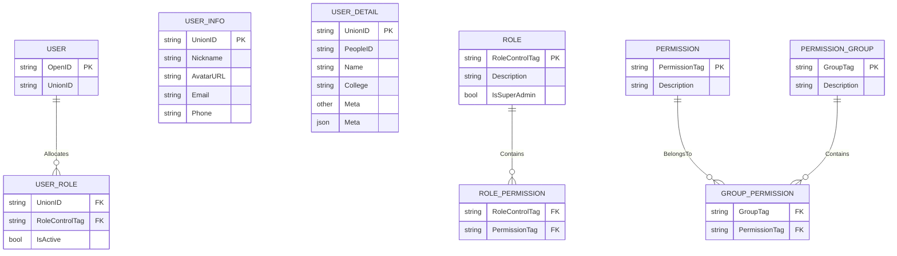
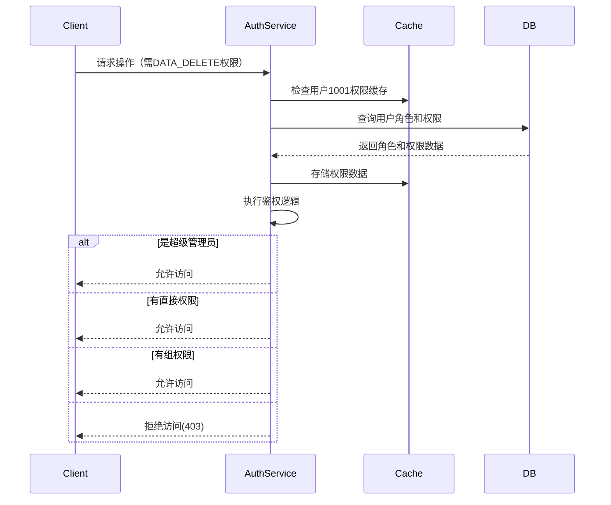

# RBAC Design: Role-Based Access Control Design

RBAC是每一个涉及到权限控制的系统都需要设计的部分。它提供了一种灵活的方式来管理用户权限，确保系统的安全性和可维护性。

在微信登录完成后，我们需要根据用户的角色和权限来控制他们在系统中的操作。RBAC设计将帮助我们实现这一目标。

系统采用 **用户-角色-权限** 三级关系进行权限控制。每个用户可以拥有多个角色，每个角色可以拥有多个权限。



## 文档更新记录


| Code | Module | Date       | Author | PRI | Description |
|------|--------|------------|--------|-----|-------------|
| 1    | init   | 2025-06-22 | AEnjoy | P0  | 初始设计文档创建    |


## 设计原则

1. **高内聚低耦合**: RBAC模块与其他模块通过接口和事件解耦，确保模块独立性(可以独立测试和部署)
2. **安全性**: 确保用户权限的安全性，防止未授权访问
3. **易用性**: 提供简单易用的权限管理接口
4. **可扩展性**: 支持动态添加和修改角色和权限
5. **性能**: 确保权限检查的高效性，避免性能瓶颈

## 模型

角色表: (RoleControlTag (PK), Description)

权限表: (PermissionTag (PK), Description)

用户角色关联表 (UserRole): (UnionID (FK), RoleControlTag (FK), IsActive (bool, 默认true))

用户权限关联表 (RolePermission): (RoleControlTag (FK), PermissionTag (FK))

权限组表 (PermissionGroup): (GroupTag (PK), Description)

权限组关联表 (GroupPermission): (GroupTag (FK), PermissionTag (FK))

角色-组权限关联表 (RoleGroupPermission): (RoleControlTag (FK), GroupTag (FK))

## 初始化：
```sql
CREATE TABLE PermissionGroup (
    GroupTag VARCHAR(50) PRIMARY KEY,
    Description TEXT NOT NULL
);
CREATE TABLE GroupPermission (
    GroupTag VARCHAR(50) NOT NULL,
    PermissionTag VARCHAR(50) NOT NULL,
    PRIMARY KEY (GroupTag, PermissionTag),
    FOREIGN KEY (GroupTag) REFERENCES PermissionGroup(GroupTag),
    FOREIGN KEY (PermissionTag) REFERENCES Permission(PermissionTag)
);
CREATE TABLE RolePermissionGroup (
    RoleControlTag VARCHAR(50) NOT NULL,
    GroupTag VARCHAR(50) NOT NULL,
    PRIMARY KEY (RoleControlTag, GroupTag),
    FOREIGN KEY (RoleControlTag) REFERENCES Role(RoleControlTag),
    FOREIGN KEY (GroupTag) REFERENCES PermissionGroup(GroupTag)
);

INSERT INTO PermissionGroup (GroupTag, Description)
VALUES ('DATA_MANAGERS', '数据管理权限组');

INSERT INTO GroupPermission (GroupTag, PermissionTag)
VALUES 
    ('DATA_MANAGERS', 'DATA_VIEW'),
    ('DATA_MANAGERS', 'DATA_EDIT'),
    ('DATA_MANAGERS', 'DATA_DELETE');

INSERT INTO RolePermissionGroup (RoleControlTag, GroupTag)
VALUES ('COLLEGE_ADMIN', 'DATA_MANAGERS');
```

## 鉴权流程：

1. 用户登录后，系统根据用户的UnionID查询其关联的角色列表。
2. 根据角色列表查询每个角色的权限列表。
3. 将权限列表缓存到用户会话中。
4. 在每次请求时，系统检查用户的权限是否包含所请求的操作对应的权限。

流程：




鉴权函数：

```pseudocode
func checkPermission(union_id, required_permission) {
    permissions, err := cache.GetPermissions(union_id)
    if err != nil {
        roles, err := database.QueryRolesByUnionID(union_id)
        if err != nil {
            return false, err
        }
		
        permissions = database.QueryPermissionsByRoles(roles)
        
        // 缓存权限数据
        cache.SetPermissions(union_id, permissions)
    }

    // 检查是否包含所需权限
    for _, permission := range permissions {
        if permission == required_permission {
            return true, nil
        }
    }
    
    return false, nil
}
```
