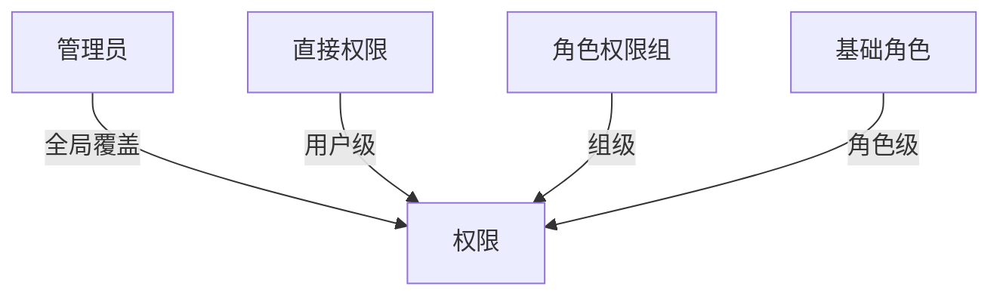
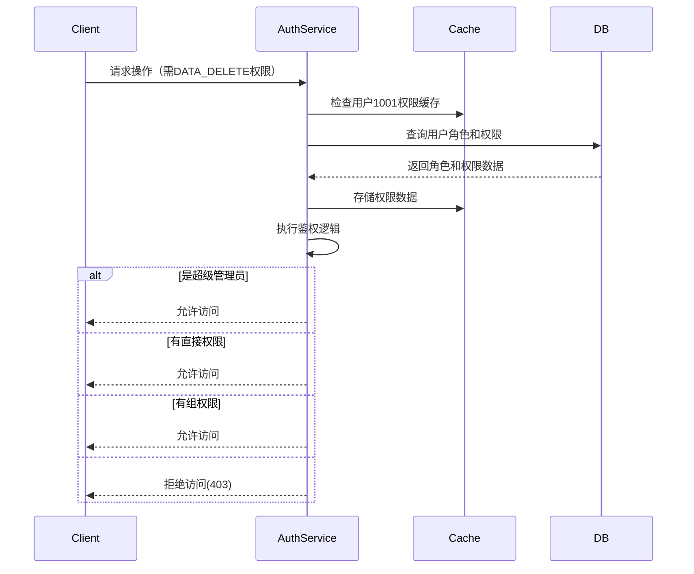

# RBAC Design: Role-Based Access Control Design

RBAC是每一个涉及到权限控制的系统都需要设计的部分。它提供了一种灵活的方式来管理用户权限，确保系统的安全性和可维护性。

在微信登录完成后，我们可以获取到OpenID和UnionID，我们需要根据用户的角色和权限来控制他们在系统中的操作。RBAC设计将帮助我们实现这一目标。

系统采用 **全局-永久-组-角色** 四级关系进行权限控制。每个用户可以拥有多个角色，也可以拥有自己的权限，每个角色可以拥有多个权限。



## 文档更新记录


| Code | Module | Date       | Author | PRI | Description |
|------|--------|------------|--------|-----|-------------|
| 1    | init   | 2025-06-25 | AEnjoy | P0  | 初始设计文档创建    |


## 设计原则

1. **高内聚低耦合**: RBAC模块与其他模块通过接口和事件解耦，确保模块独立性(可以独立测试和部署)
2. **安全性**: 确保用户权限的安全性，防止未授权访问
3. **精细度**: 支持细粒度的权限控制，允许对特定资源和操作进行精确授权
4. **易用性**: 提供简单易用的权限管理接口
5. **可扩展性**: 支持动态添加和修改角色和权限
6. **性能**: 确保权限检查的高效性，避免性能瓶颈，**建议将该部分存入缓存中**

## 用户类别

- **访客**: 未微信登录的用户，没有任何权限，仅能查看公开信息页面
- **被禁言用户**: 普通用户被禁言后，无法进行评论、请求上传资源等操作
- **普通用户**: 通过微信已登录的用户，拥有基本的查看、评论、请求添加/上传资源、下载资源权限
- **社区管理员**: 负责社区管理，拥有数据查看、编辑、删除、审查评论和资源、禁言用户等权限（不可查看用户隐私信息）
- **系统管理员**: 负责系统管理，拥有所有权限，包括用户管理（可以查看用户详细信息）、角色管理、权限管理等

## 模型

角色表: (RoleControlTag (PK), Description)

权限表: (PermissionTag (PK), Description)

用户角色关联表 (UserRole): (UnionID (FK), RoleControlTag (FK), IsActive (bool, 默认true))

用户直接权限表 (RolePermission): (UnionID (FK), PermissionTag (FK),IsGranted(bool,default true), *ExpiryTime)

用户权限关联表 (RolePermission): (RoleControlTag (FK), PermissionTag (FK))

权限组表 (PermissionGroup): (GroupTag (PK), Description)

权限组关联表 (GroupPermission): (GroupTag (FK), PermissionTag (FK))

角色-组权限关联表 (RoleGroupPermission): (RoleControlTag (FK), GroupTag (FK))

## 初始化：
```sql
/*
权限组：

定义一个权限

*/
CREATE TABLE PermissionGroup (
    GroupTag VARCHAR(50) PRIMARY KEY,
    Description TEXT 
);
CREATE TABLE GroupPermission (
    GroupTag VARCHAR(50) NOT NULL,
    PermissionTag VARCHAR(50) NOT NULL,
    PRIMARY KEY (GroupTag, PermissionTag),
    FOREIGN KEY (GroupTag) REFERENCES PermissionGroup(GroupTag),
    FOREIGN KEY (PermissionTag) REFERENCES Permission(PermissionTag)
);
CREATE TABLE RolePermissionGroup (
    RoleControlTag VARCHAR(50) NOT NULL,
    GroupTag VARCHAR(50) NOT NULL,
    PRIMARY KEY (RoleControlTag, GroupTag),
    FOREIGN KEY (RoleControlTag) REFERENCES Role(RoleControlTag),
    FOREIGN KEY (GroupTag) REFERENCES PermissionGroup(GroupTag)
);
/*
用户直接权限表：

用户可以直接拥有某些权限，这些权限不受角色限制。
同时该权限可以设置过期时间，过期后自动失效。
*/
CREATE TABLE UserDirectPermission (
    UnionID VARCHAR(50) NOT NULL,
    PermissionTag VARCHAR(50) NOT NULL,
    IsGranted BOOLEAN NOT NULL DEFAULT TRUE,
    ExpiryTime TIMESTAMP NULL,
    CreatedAt TIMESTAMP NOT NULL DEFAULT CURRENT_TIMESTAMP,
    PRIMARY KEY (UnionID, PermissionTag),
    FOREIGN KEY (UnionID) REFERENCES User(UnionID),
    FOREIGN KEY (PermissionTag) REFERENCES Permission(PermissionTag)
);
INSERT INTO PermissionGroup (GroupTag, Description)
VALUES
    ('BASIC_ACCESS', '基础访问权限（所有登录用户）'),
    ('CONTENT_INTERACTION', '内容交互权限'),
    ('RESOURCE_MANAGEMENT', '资源管理权限'),
    ('COMMUNITY_MODERATION', '社区管理权限'),
    ('SYSTEM_ADMINISTRATION', '系统管理权限'),
    ('RESTRICTED_USER', '受限用户权限组');

INSERT INTO Permission (PermissionTag, Description)
VALUES
    ('PUBLIC_VIEW', '查看公开信息'),
    ('LOGIN_REQUIRED_VIEW', '查看需登录内容'),
    ('COMMENT_POST', '发表评论'),
    ('REQUEST_RESOURCE', '请求添加资源'),
    ('UPLOAD_RESOURCE', '上传资源文件'),
    ('DOWNLOAD_RESOURCE', '下载资源'),
    ('EDIT_ANY_CONTENT', '编辑所有内容'),
    ('DELETE_ANY_CONTENT', '删除任何内容'),
    ('REVIEW_COMMENTS', '审核评论'),
    ('MUTE_USERS', '禁言用户'),
    ('MANAGE_RESOURCES', '管理资源审批'),
    ('VIEW_USER_PROFILES', '查看用户完整资料'),
    ('MANAGE_USER_ROLES', '管理用户角色'),
    ('MANAGE_SYSTEM_SETTINGS', '管理系统配置'),
    ('BYPASS_RESTRICTIONS', '绕过所有限制');

INSERT INTO GroupPermission (GroupTag, PermissionTag)
VALUES
    -- 基础访问
    ('BASIC_ACCESS', 'PUBLIC_VIEW'),
    ('BASIC_ACCESS', 'LOGIN_REQUIRED_VIEW'),

    -- 内容交互
    ('CONTENT_INTERACTION', 'COMMENT_POST'),
    ('CONTENT_INTERACTION', 'REQUEST_RESOURCE'),
    ('CONTENT_INTERACTION', 'DOWNLOAD_RESOURCE'),

    -- 资源管理
    ('RESOURCE_MANAGEMENT', 'UPLOAD_RESOURCE'),

    -- 社区管理
    ('COMMUNITY_MODERATION', 'EDIT_ANY_CONTENT'),
    ('COMMUNITY_MODERATION', 'DELETE_ANY_CONTENT'),
    ('COMMUNITY_MODERATION', 'REVIEW_COMMENTS'),
    ('COMMUNITY_MODERATION', 'MUTE_USERS'),
    ('COMMUNITY_MODERATION', 'MANAGE_RESOURCES'),

    -- 系统管理组
    ('SYSTEM_ADMINISTRATION', 'VIEW_USER_PROFILES'),
    ('SYSTEM_ADMINISTRATION', 'MANAGE_USER_ROLES'),
    ('SYSTEM_ADMINISTRATION', 'MANAGE_SYSTEM_SETTINGS'),
    ('SYSTEM_ADMINISTRATION', 'BYPASS_RESTRICTIONS'),

    -- 受限用户（空权限）
    ('RESTRICTED_USER', 'PUBLIC_VIEW');
INSERT INTO Role (RoleControlTag, Description, IsSuperAdmin)
VALUES
    ('GUEST', '未登录访客', false),
    ('RESTRICTED', '被禁言用户', false),
    ('USER', '普通用户', false),
    ('MODERATOR', '社区管理员', false),
    ('ADMIN', '系统管理员', true);

INSERT INTO RolePermissionGroup (RoleControlTag, GroupTag)
VALUES
    -- 访客（仅基础访问中的公开部分）
    ('GUEST', 'BASIC_ACCESS'),

    -- 被禁言用户（基础访问+受限标记）
    ('RESTRICTED', 'BASIC_ACCESS'),
    ('RESTRICTED', 'RESTRICTED_USER'),

    -- 普通用户（基础+内容交互+资源上传）
    ('USER', 'BASIC_ACCESS'),
    ('USER', 'CONTENT_INTERACTION'),
    ('USER', 'RESOURCE_MANAGEMENT'),

    -- 社区管理员（继承普通用户所有权限+管理权限）
    ('MODERATOR', 'BASIC_ACCESS'),
    ('MODERATOR', 'CONTENT_INTERACTION'),
    ('MODERATOR', 'RESOURCE_MANAGEMENT'),
    ('MODERATOR', 'COMMUNITY_MODERATION'),

    -- 超级管理员（通过IsSuperAdmin字段自动获得所有权限）
    ('ADMIN', 'SYSTEM_ADMINISTRATION');
```

## 鉴权流程：

1. 用户登录后，检查直接权限，如果拥有所请求的权限，则直接允许访问。
   - 例如，用户1001请求删除数据，系统首先检查用户1001是否有DATA_DELETE权限。
   - 如果有，则直接允许访问。
   - 如果没有，则继续下一步。
2. 系统根据用户的UnionID查询其关联的角色列表。
3. 根据角色列表查询每个角色的权限列表。
4. 将权限列表缓存到用户会话中。
5. 在每次请求时，系统检查用户的权限是否包含所请求的操作对应的权限。

流程：




鉴权函数：

```pseudocode
func checkPermission(union_id, required_permission) {
    permissions, err := GetPermissions(union_id)
    if err != nil {
        return false, err
    }

    // isAdmin?
    if permissions.IsSuperAdmin {
        // 超级管理员拥有所有权限
        return true, nil
    }
    
    
    // 检查直接权限
    if direct:=permissions.Contains(required_permission);direct!=nil {
        if direct.IsGranted {
            // 直接权限
            return true, nil
        } else {
            // 直接权限被拒绝
            return false, nil
        }
    }
    // 查询用户角色组
    permissionGroup, err := GetPermissionGroup(union_id)
    if err != nil {
        return false, err
    }
    
    if permissionGroup.Contains(required_permission) {
        return true, nil
    }
    
    return false, nil
}
```

以上步骤也可以合并为一个SQL，从而实现用户-组-角色级权限覆盖：

```sql
CREATE VIEW UserEffectivePermissions AS
SELECT UnionID, PermissionTag, 'DIRECT' AS Source
FROM UserDirectPermission
WHERE IsGranted = TRUE 
  AND (ExpiryTime IS NULL OR ExpiryTime > NOW())
UNION 
SELECT ur.UnionID, rp.PermissionTag, 'ROLE' AS Source
FROM UserRole ur
JOIN RolePermission rp ON ur.RoleControlTag = rp.RoleControlTag
WHERE ur.IsActive = TRUE
    AND (rp.ExpiryTime IS NULL OR rp.ExpiryTime > NOW())
UNION
SELECT ur.UnionID, gp.PermissionTag, 'GROUP' AS Source
FROM UserRole ur
JOIN RoleGroupPermission rgp ON ur.RoleControlTag = rgp.RoleControlTag
JOIN GroupPermission gp ON rgp.GroupTag = gp.GroupTag
WHERE ur.IsActive = TRUE
    AND (gp.ExpiryTime IS NULL OR gp.ExpiryTime > NOW());
```


## 角色控制标签

| code | 角色控制标签     | 描述                  |
|------|------------|---------------------|
| 1    | GUEST      | 未登录访客               |
| 2    | RESTRICTED | 被禁言用户               |  
| 3    | USER       | 普通用户                |    
| 4    | MODERATOR  | 社区管理员               |  
| 5    | ADMIN      | 系统超级管理员             |  
| 6    | SYSTEM     | 系统账户（系统账户会自动管理用户权限） |


## 审计

审计日志记录用户的权限变更记录，以及是谁对用户进行了权限变更。审计日志表结构如下：

```sql
CREATE TABLE AuditLog (
    id INT AUTO_INCREMENT PRIMARY KEY,
    UnionID VARCHAR(50) NOT NULL,
    Action VARCHAR(100) NOT NULL,
    TargetRole VARCHAR(50) NOT NULL,
    ChangedBy VARCHAR(50) NOT NULL,
    ChangeTime TIMESTAMP NOT NULL DEFAULT CURRENT_TIMESTAMP,
    FOREIGN KEY (UnionID) REFERENCES User(UnionID),
    FOREIGN KEY (ChangedBy) REFERENCES User(UnionID)
);
```

## 接口定义

以下是RBAC模块的核心接口定义，包含用户管理、角色管理、权限管理、权限组管理、鉴权服务和审计服务等。

**在实现功能时，不必完全遵循接口定义和里面的数据类型，但建议遵循接口的设计原则和方法签名，以便于后续的维护和扩展。**


```go
package rbac

import (
	"context"
	"time"
	
	"model"
)

type repository interface {
	// cache 
	SetRedisClient(redisClient RedisClient)
	GetRedisClient() RedisClient
	// database
	SetDBClient(dbClient DBClient)
	GetDBClient() DBClient
}

// 权限系统核心接口
type RBACManager interface {
	// 用户管理
	UserManager
	// 角色管理
	RoleManager
	// 权限管理
	PermissionManager
	// 权限组管理
	GroupManager
	// 鉴权服务
	AuthorizationService
	// 审计服务
	AuditLogger
}

// 用户管理接口
type UserManager interface {
	AddUser(ctx context.Context, user model.User) error
	GetUser(ctx context.Context, unionID string) (*model.User, error)
	AssignRoleToUser(ctx context.Context, unionID, roleTag string) error
	RevokeRoleFromUser(ctx context.Context, unionID, roleTag string) error
	GetUserRoles(ctx context.Context, unionID string) ([]model.Role, error)
	
	// 用户直接权限管理
	GrantPermissionToUser(ctx context.Context, unionID, permissionTag string, expiry *time.Time) error
	RevokePermissionFromUser(ctx context.Context, unionID, permissionTag string) error
	UpdateUserPermission(ctx context.Context, unionID, permissionTag string, granted bool, expiry *time.Time) error
	GetUserDirectPermissions(ctx context.Context, unionID string) ([]model.PermissionAssignment, error)

    repository
}

// 角色管理接口
type RoleManager interface {
	CreateRole(ctx context.Context, role model.Role) error
	DeleteRole(ctx context.Context, roleTag string) error
	GetRole(ctx context.Context, roleTag string) (*model.Role, error)
	SetRoleSuperAdmin(ctx context.Context, roleTag string, isSuper bool) error
	AssignGroupToRole(ctx context.Context, roleTag, groupTag string) error
	RemoveGroupFromRole(ctx context.Context, roleTag, groupTag string) error

    repository
}

// 权限管理接口
type PermissionManager interface {
	CreatePermission(ctx context.Context, permission model.Permission) error
	DeletePermission(ctx context.Context, permissionTag string) error
	GetPermission(ctx context.Context, permissionTag string) (*model.Permission, error)
	AddPermissionToGroup(ctx context.Context, groupTag, permissionTag string) error
	RemovePermissionFromGroup(ctx context.Context, groupTag, permissionTag string) error
	
	GetPermissionsByGroup(ctx context.Context, groupTag string) ([]model.Permission, error)
	GetAllPermissions(ctx context.Context) ([]model.Permission, error)
	GetUserEffectivePermissions(ctx context.Context, unionID string) ([]model.Permission, error)
	GetRolePermissions(ctx context.Context, roleTag string) ([]model.Permission, error)

    repository
}

// 权限组管理接口
type GroupManager interface {
	AddGroup(ctx context.Context, group model.PermissionGroup) error
	DeleteGroup(ctx context.Context, groupTag string) error
	GetGroup(ctx context.Context, groupTag string) (*model.PermissionGroup, error)
	GetGroupPermissions(ctx context.Context, groupTag string) ([]model.Permission, error)

    repository
}

// 鉴权服务接口
type AuthorizationService interface {
	CheckPermission(ctx context.Context, unionID, permissionTag string) (bool, error)
	GetUserEffectivePermissions(ctx context.Context, unionID string) ([]model.Permission, error)
	HasAnyPermission(ctx context.Context, unionID string, permissionTags ...string) (bool, error)
	HasAllPermissions(ctx context.Context, unionID string, permissionTags ...string) (bool, error)
	
	// 带上下文的鉴权（资源级权限）(optionally)
	CheckPermissionWithResource(ctx context.Context, unionID, permissionTag, resourceID string) (bool, error)

    repository
}

// 审计日志接口
type AuditLogger interface {
	SetLogger(logger Logger)
	LogPermissionGrant(ctx context.Context, operatorID, targetUserID, permissionTag string, expiry *time.Time) error
	LogPermissionRevoke(ctx context.Context, operatorID, targetUserID, permissionTag string) error
	QueryAuditLogs(ctx context.Context, query ...model.AuditQuery) ([]model.AuditLog, error)
}

// 支持资源级权限的接口(可选)
type ResourceAuthorizer interface {
	SetResourcePermission(ctx context.Context, resourceID, permissionTag string, granted bool) error
	DeleteResourcePermission(ctx context.Context, resourceID, permissionTag string) error
	GetResourcePermissions(ctx context.Context, resourceID string) ([]model.PermissionAssignment, error)

   repository
}
```

