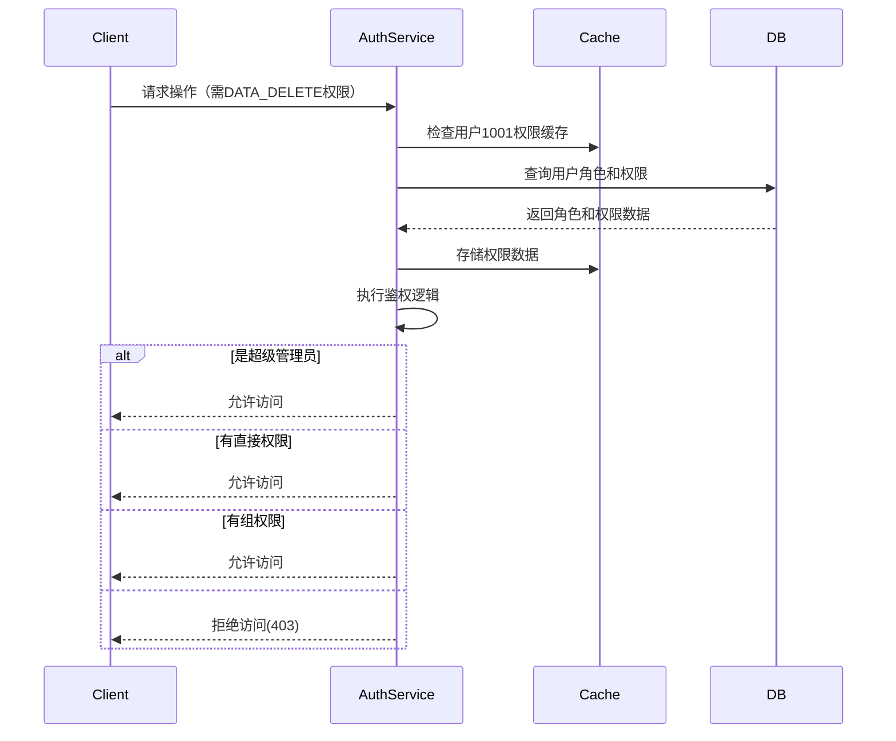

# RBAC Design: Role-Based Access Control Design

RBAC是每一个涉及到权限控制的系统都需要设计的部分。它提供了一种灵活的方式来管理用户权限，确保系统的安全性和可维护性。

在微信登录完成后，我们可以获取到OpenID和UnionID，我们需要根据用户的角色和权限来控制他们在系统中的操作。RBAC设计将帮助我们实现这一目标。

## 文档更新记录


| Code | Module | Date       | Author | PRI | Description |
|------|--------|------------|--------|-----|-------------|
| 1    | init   | 2025-06-25 | AEnjoy | P0  | 初始设计文档创建    |
| 2    | update | 2025-12-22 | Benins | P0  | 更新           |


## 设计原则

1. **高内聚低耦合**: RBAC模块与其他模块通过接口和事件解耦，确保模块独立性(可以独立测试和部署)
2. **安全性**: 确保用户权限的安全性，防止未授权访问
3. **精细度**: 支持细粒度的权限控制，允许对特定资源和操作进行精确授权
4. **易用性**: 提供简单易用的权限管理接口
5. **可扩展性**: 支持动态添加和修改角色和权限
6. **性能**: 确保权限检查的高效性，避免性能瓶颈，**建议将该部分存入缓存中**

## 用户类别

- **访客**: 未微信登录的用户，仅能访问公开接口
- **基本用户**: 微信登陆后默认授予的用户角色
- **活跃用户**: 系统根据活跃度计算规则自动升级，解锁部分权限
- **认证用户**: 主动完成校内身份认证的用户，解锁部分权限
- **运营**: 负责社区管理，拥有部分管理权限
- **管理**: 负责系统管理，拥有所有权限

## 模型

角色表: (Id (PK), RoleTag, Name, Description)

权限表: (Id (PK), PermissionTag, Name, Description)

用户角色关联 (UserRole): (UserId (FK), RoleId)

角色权限关联表 (RolePermission): (RoleId (FK), PermissionId (FK))

## 初始化：
```sql
-- 角色种子数据
INSERT INTO Role (RoleTag, Name, Description) VALUES
  ('guest',        '访客',     '未登录，仅可访问公开接口'),
  ('user_basic',   '基本用户', '微信登录后默认角色'),
  ('user_active',  '活跃用户', '活跃度达标，解锁更多读写能力'),
  ('user_verified','认证用户', '完成校内身份认证'),
  ('operator',     '运营',     '内容/社区运营管理'),
  ('admin',        '管理',     '系统管理员，拥有全部权限')
ON DUPLICATE KEY UPDATE Name = VALUES(Name), Description = VALUES(Description);

-- 权限种子数据（结合当前接口：公共/用户/学习任务/运营/系统）
INSERT INTO Permission (PermissionTag, Name, Description) VALUES
  -- 公共能力
  ('public.health',              '健康检查',           'GET /healthz'),
  ('public.review.list',         '查看点评列表',       'GET /api/v0/reviews'),
  ('public.config.read',         '读取公开配置',       'GET /api/v0/config'),
  ('public.hero.read',           '查看英雄榜',         'GET /api/v0/heroes'),
  ('public.notification.read',   '查看通知',           'GET /api/v0/notifications'),
  ('public.category.read',       '查看分类',           'GET /api/v0/categories'),
  -- 基础用户能力
  ('profile.read.self',          '查看个人资料',       'GET /api/v0/profile'),
  ('review.create',              '发布点评',           'POST /api/v0/reviews'),
  ('review.update.self',         '修改本人点评',       'PUT /api/v0/reviews/{id}'),
  ('review.delete.self',         '删除本人点评',       'DELETE /api/v0/reviews/{id}'),
  ('course.table.read',          '查看课表',           'GET /api/v0/course-table'),
  ('exam.failrate.read',         '查看挂科率',         'GET /api/v0/fail-rate'),
  ('points.read',                '查看积分',           'GET /api/v0/points'),
  ('contribution.read',          '查看贡献/勋章',     'GET /api/v0/contributions'),
  ('countdown.read',             '查看倒计时',         'GET /api/v0/countdowns'),
  ('studytask.read.self',        '查看个人学习任务',   'GET /api/v0/study-tasks'),
  ('studytask.write.self',       '管理个人学习任务',   'POST/PUT/DELETE /api/v0/study-tasks'),
  -- 活跃/认证用户增量
  ('studytask.read.all',         '查看公共学习任务',   'GET /api/v0/study-tasks/public'),
  -- 运营能力
  ('review.moderate',            '点评审核/隐藏',      'PUT /api/v0/admin/reviews'),
  ('notification.manage',        '通知管理',           'POST/PUT/DELETE /api/v0/admin/notifications'),
  ('hero.manage',                '英雄榜管理',         'POST/PUT/DELETE /api/v0/admin/heroes'),
  ('category.manage',            '分类管理',           'POST/PUT/DELETE /api/v0/admin/categories'),
  ('studytask.manage',           '公共学习任务管理',   'POST/PUT/DELETE /api/v0/admin/study-tasks'),
  -- 系统能力
  ('config.manage',              '系统配置管理',       'POST/PUT/DELETE /api/v0/admin/config'),
  ('user.manage',                '用户管理',           '管理员用户/角色分配'),
  ('rbac.manage',                'RBAC管理',           '角色/权限维护')
ON DUPLICATE KEY UPDATE Name = VALUES(Name), Description = VALUES(Description);

-- 角色-权限绑定（INSERT IGNORE 便于幂等）
-- 访客：仅公共读取
INSERT IGNORE INTO RolePermission (RoleId, PermissionId)
SELECT r.Id, p.Id FROM Role r JOIN Permission p ON p.PermissionTag IN (
  'public.health','public.review.list','public.config.read',
  'public.hero.read','public.notification.read','public.category.read'
) WHERE r.RoleTag = 'guest';

-- 基本用户：访客 + 个人资源读写
INSERT IGNORE INTO RolePermission (RoleId, PermissionId)
SELECT r.Id, p.Id FROM Role r JOIN Permission p ON p.PermissionTag IN (
  'public.health','public.review.list','public.config.read',
  'public.hero.read','public.notification.read','public.category.read',
  'profile.read.self','review.create','review.update.self','review.delete.self',
  'course.table.read','exam.failrate.read','points.read','contribution.read',
  'countdown.read','studytask.read.self','studytask.write.self'
) WHERE r.RoleTag = 'user_basic';

INSERT IGNORE INTO RolePermission (RoleId, PermissionId)
SELECT r.Id, p.Id FROM Role r JOIN Permission p ON p.PermissionTag IN (
  'public.health','public.review.list','public.config.read',
  'public.hero.read','public.notification.read','public.category.read',
  'profile.read.self','review.create','review.update.self','review.delete.self',
  'course.table.read','exam.failrate.read','points.read','contribution.read',
  'countdown.read','studytask.read.self','studytask.write.self',
  'studytask.read.all'
) WHERE r.RoleTag = 'user_active';

-- 认证用户：沿用活跃用户权限（若需差异，可在此追加）
INSERT IGNORE INTO RolePermission (RoleId, PermissionId)
SELECT r.Id, p.Id FROM Role r JOIN Permission p ON p.PermissionTag IN (
  'public.health','public.review.list','public.config.read',
  'public.hero.read','public.notification.read','public.category.read',
  'profile.read.self','review.create','review.update.self','review.delete.self',
  'course.table.read','exam.failrate.read','points.read','contribution.read',
  'countdown.read','studytask.read.self','studytask.write.self',
  'studytask.read.all'
) WHERE r.RoleTag = 'user_verified';

-- 运营：用户权限 + 内容管理
INSERT IGNORE INTO RolePermission (RoleId, PermissionId)
SELECT r.Id, p.Id FROM Role r JOIN Permission p ON p.PermissionTag IN (
  'public.health','public.review.list','public.config.read',
  'public.hero.read','public.notification.read','public.category.read',
  'profile.read.self','review.create','review.update.self','review.delete.self',
  'course.table.read','exam.failrate.read','points.read','contribution.read',
  'countdown.read','studytask.read.self','studytask.write.self',
  'studytask.read.all',
  'review.moderate','notification.manage','hero.manage',
  'category.manage','studytask.manage'
) WHERE r.RoleTag = 'operator';

-- 管理：全量权限（包含运营 + 系统能力）
INSERT IGNORE INTO RolePermission (RoleId, PermissionId)
SELECT r.Id, p.Id FROM Role r JOIN Permission p
WHERE r.RoleTag = 'admin';

-- 可选：初始化一个超级管理员账号，将其绑定管理角色
-- INSERT IGNORE INTO UserRole (UserId, RoleId)
-- VALUES ('SUPER_ADMIN_UNION_ID', (SELECT Id FROM Role WHERE RoleTag = 'admin'));
```

## 鉴权流程：

1. 用户登录后，检查直接权限，如果拥有所请求的权限，则直接允许访问。
   - 例如，用户1001请求删除数据，系统首先检查用户1001是否有DATA_DELETE权限。
   - 如果有，则直接允许访问。
   - 如果没有，则继续下一步。
2. 系统根据用户的UserID查询其关联的角色列表。
3. 根据角色列表查询每个角色的权限列表。
4. 将权限列表缓存到用户会话中。
5. 在每次请求时，系统检查用户的权限是否包含所请求的操作对应的权限。

流程：




鉴权函数：

```pseudocode
func checkPermission(union_id, required_permission) {
    permissions, err := GetPermissions(union_id)
    if err != nil {
        return false, err
    }

    // isAdmin?
    if permissions.IsSuperAdmin {
        // 超级管理员拥有所有权限
        return true, nil
    }
    
    
    // 检查直接权限
    if direct:=permissions.Contains(required_permission);direct!=nil {
        if direct.IsGranted {
            // 直接权限
            return true, nil
        } else {
            // 直接权限被拒绝
            return false, nil
        }
    }
    // 查询用户角色组
    permissionGroup, err := GetPermissionGroup(union_id)
    if err != nil {
        return false, err
    }
    
    if permissionGroup.Contains(required_permission) {
        return true, nil
    }
    
    return false, nil
}
```

以上步骤也可以合并为一个SQL，从而实现用户-组-角色级权限覆盖：

```sql
CREATE VIEW UserEffectivePermissions AS
SELECT userId, PermissionTag, 'DIRECT' AS Source
FROM UserDirectPermission
WHERE IsGranted = TRUE 
  AND (ExpiryTime IS NULL OR ExpiryTime > NOW())
UNION 
SELECT ur.userId, rp.PermissionTag, 'ROLE' AS Source
FROM UserRole ur
JOIN RolePermission rp ON ur.RoleControlTag = rp.RoleControlTag
WHERE ur.IsActive = TRUE
    AND (rp.ExpiryTime IS NULL OR rp.ExpiryTime > NOW())
UNION
SELECT ur.userId, gp.PermissionTag, 'GROUP' AS Source
FROM UserRole ur
JOIN RoleGroupPermission rgp ON ur.RoleControlTag = rgp.RoleControlTag
JOIN GroupPermission gp ON rgp.GroupTag = gp.GroupTag
WHERE ur.IsActive = TRUE
    AND (gp.ExpiryTime IS NULL OR gp.ExpiryTime > NOW());
```

## 接口定义

```go
package rbac

import (
	"context"
	"time"
	
	"model"
)

// 权限系统核心接口
type RBACManager interface {
	// 用户管理
	UserManager
	// 角色管理
	RoleManager
	// 权限管理
	PermissionManager
	// 鉴权服务
	AuthorizationService
}

// 用户管理接口
type UserManager interface {

}

// 角色管理接口
type RoleManager interface {

}

// 权限管理接口
type PermissionManager interface {

}

// 鉴权服务接口
type AuthorizationService interface {

}

```

