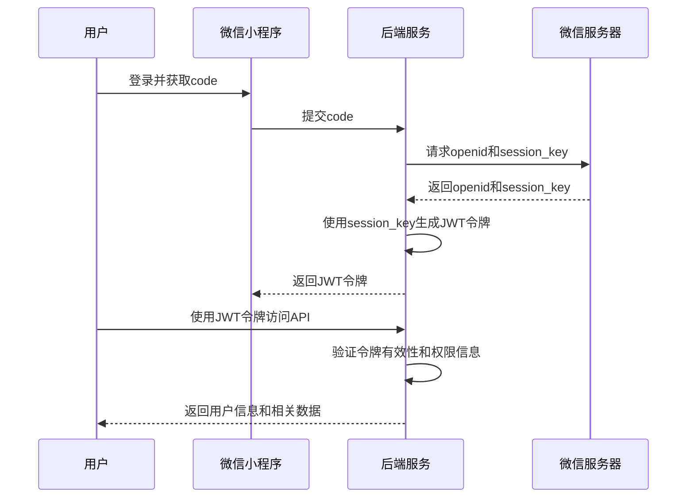

# System design 系统设计

`一起来学`校园服务微信小程序的后端,基于Go语言开发的校园服务微信小程序后端系统。

计划逐步实现的功能：

来学：通知公告（活动中心）、此时江理、实况江理、资料库、英雄榜
学业：课程表、选课助手、成绩、考试安排、绩点排名、挂科率、毕业论文、学分（学历学位条件）
发展：大学生涯、转专业、竞赛、考证、交换生、未来发展
科研：助理招募、大创项目、伙伴匹配
认可：综合测评、荣誉奖励
未来：保研、考研、就业、实习、考公、留学、校友内推
校园：成绩单、校历、快递地址、视觉资源、学生手册、校园风光、地图、模板、日程、通讯录
生活：电费查询、社团空间、经验分享、倒数日、失物招领、学习清单

## 文档更新记录
| Code | Module | Date       | Author | PRI | Description |
|------|--------|------------|--------|-----|-------------|
| 1    | init   | 2025-06-21 | AEnjoy | P0  | 初始设计文档创建    |
| 2    | update | 2025-07-08 | Benins | P0  | 规划功能，完善初版模块 |
| 3    | update | 2025-08-19 | Benins | P0  | V1.0版本对应需求 |

## 授权验证流程:

1. 用户通过微信小程序提供的接口登录，获取`code`。
2. 后端使用`code`向微信服务器请求用户的`openid`和`session_key`。
3. 后端使用`session_key`加密用户信息，生成JWT令牌。
4. 用户使用JWT令牌访问后端API，后端验证令牌的有效性和用户的权限信息。
5. 如果令牌有效，后端返回用户信息和相关数据。



## 系统整体模块

### 1. 用户认证模块 (User Authentication Module)

**核心功能**：
- 微信小程序登录认证
- JWT令牌生成和验证
- 用户信息管理
- 权限控制和授权

**技术实现**：
- 基于微信开放平台API，通过code换取openid和session_key
- 使用JWT(JSON Web Token)进行无状态身份验证
- 支持多角色权限管理（用户、管理员）
- 集成RBAC权限控制系统（后续版本实现）

**主要接口**：
- `POST /api/<version>/user/auth/wechat-login` - 微信登录
- `GET /api/<version>/user/info` - 获取用户信息
- `POST /api/<version>/user/info` - 更新用户信息

**数据模型**：
- 用户表：存储OpenID、UnionID、角色控制标签等

### 2. 日志记录模块 (Logger Module)

**核心功能**：
- 高性能结构化日志记录
- 分级日志管理（DEBUG/INFO/WARN/ERROR/FATAL）
- 日志文件轮转和压缩
- GORM数据库操作日志集成

**技术实现**：
- 基于uber-go/zap库的高性能日志系统
- 支持JSON格式结构化输出，便于日志采集分析
- 按大小或时间自动轮转日志文件
- 集成链路追踪ID，支持分布式调用链跟踪
- 无缝集成GORM的SQL执行日志

**配置参数**：
```go
type LogConfig struct {
    Level      string // 日志级别
    Filename   string // 日志文件路径
    MaxSize    int    // 单个文件最大尺寸(MB)
    MaxBackups int    // 最大保留文件数
    MaxAge     int    // 最大保留天数
    Compress   bool   // 是否压缩
}
```

**监控指标**：
- 日志写入性能监控
- 不同级别日志量统计
- 文件IO性能指标

### 3. 配置管理模块 (Configuration Module)

**核心功能**：
- 多环境配置管理（开发/测试/生产）
- 动态配置加载和热更新
- 配置文件格式支持（YAML/JSON/ENV）
- 敏感信息加密存储

**技术实现**：
- 基于Viper库实现配置管理
- 支持环境变量覆盖配置文件
- 配置项类型安全和校验
- 敏感配置项（如数据库密码、API密钥）加密存储

**配置结构**：
```go
type Config struct {
    Server   ServerConfig   `mapstructure:"server"`
    Database DatabaseConfig `mapstructure:"database"`
    Redis    RedisConfig    `mapstructure:"redis"`
    WeChat   WeChatConfig   `mapstructure:"wechat"`
    Log      LogConfig      `mapstructure:"log"`
}
```

**功能特性**：
- 配置文件监控和自动重载
- 配置项默认值和必填项检查
- 配置变更审计日志
- 多数据源配置合并策略

### 4. 选课助手模块 (Course Selection Assistant Module)

**核心功能**：
+ 查询老师 输入姓名 返回评价列表
+ 点评老师 老师姓名 教授课程 是否推荐 讲讲故事 提交评价
+ 审核评价
+ 客服反馈

**数据模型**：
- 课程评价表：学生对课程的态度和评价

### 5. 课程表模块 (Course Schedule Module)

**核心功能**：
- 绑定班级
- 班级课程表数据拉取

**技术实现**：
- 从教务系统拉取全部班级数据，处理后导入数据库提供查询

**接口设计**：
- `GET /api/v0/coursetable?semester=2025-2026-1` - 获取课程表
- `GET /api/v0/coursetable/search?keyword=2023&page=1&size=10` - 搜索可绑定班级
- `PUT /api/v0/coursetable/class` - 绑定班级到用户信息

