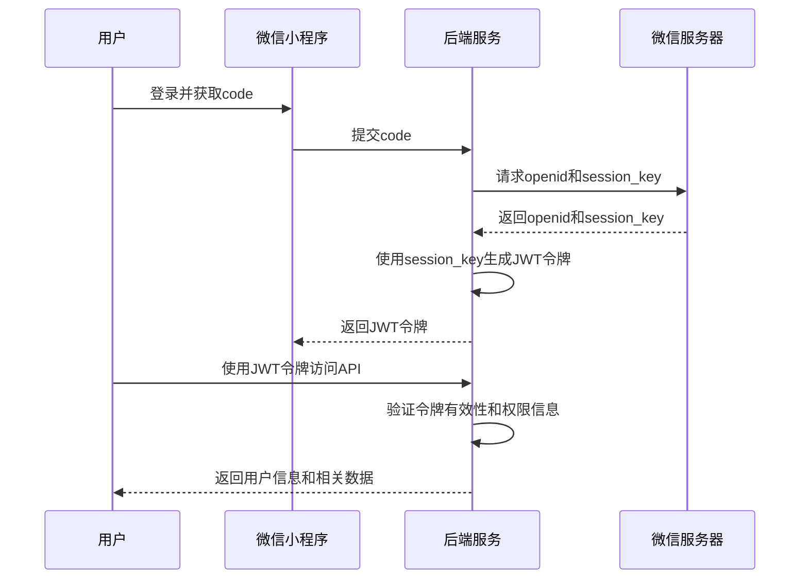

# System design 系统设计

项目是`一起来学`校园服务微信小程序的后端,

基于Go语言开发的校园服务微信小程序后端系统，

主要提供教师点评, 资料获取功能，支持未来功能扩展。

## 授权验证流程:

1. 用户通过微信小程序提供的接口登录，获取`code`。
2. 后端使用`code`向微信服务器请求用户的`openid`和`session_key`。
3. 后端使用`session_key`加密用户信息，生成JWT令牌。
4. 用户使用JWT令牌访问后端API，后端验证令牌的有效性和用户的权限信息。
5. 如果令牌有效，后端返回用户信息和相关数据。

## 系统整体模块

- 用户认证模块
- 教师点评模块
- 资料获取模块
- 日志记录模块
- 配置管理模块
- 后台管理模块
